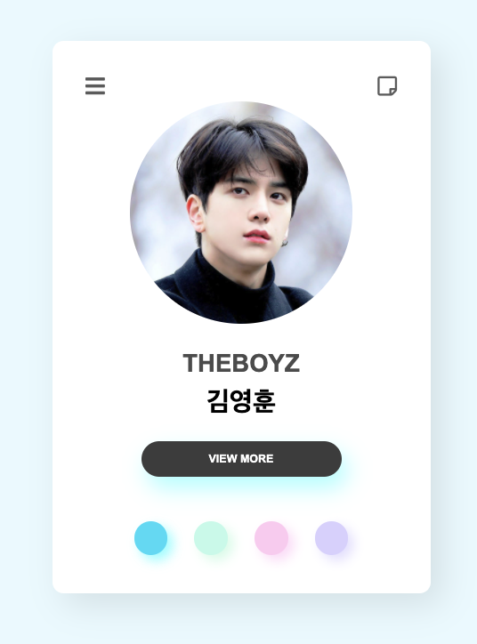
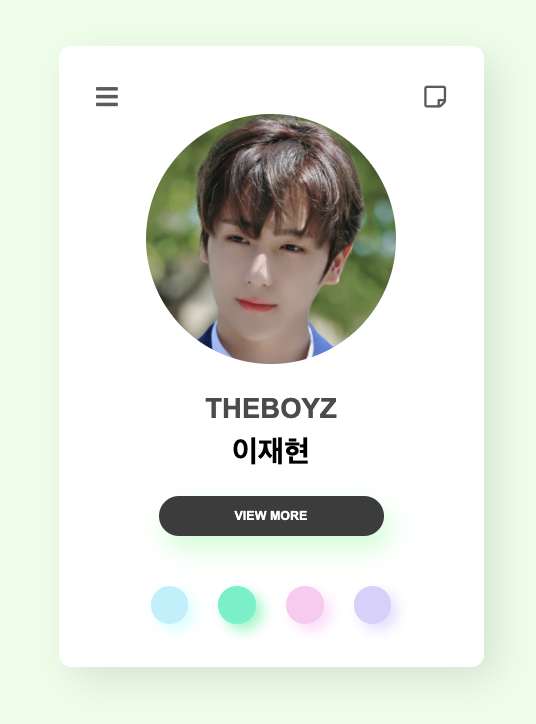
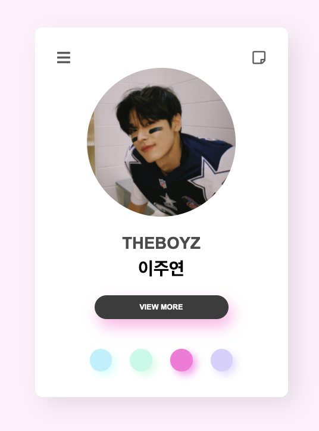
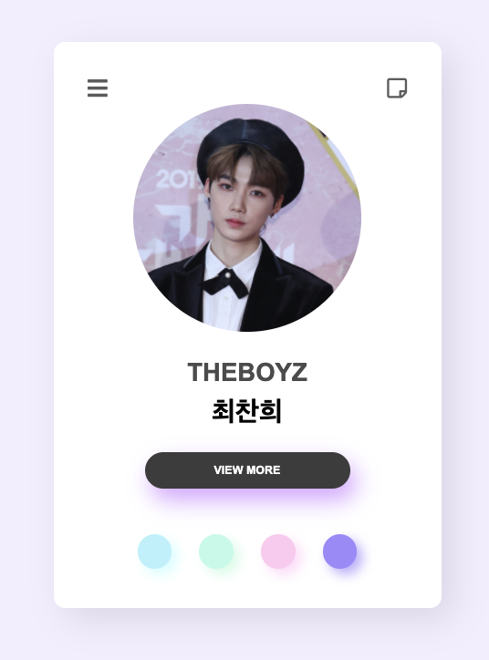

# 온라인 프로필카드 제작하기

### 학습목표
---
- 전체적인 레이아웃을 잡고 구현할 수 있다.
- \<nav> 태그를 활용하여 메뉴를 만들 수 있다.
  
- 멤버별 프로필 링크를 만들어 적용시킬 수 있다.
- 선택한 부분만 돋보이게 하는 css 코드를 구현할 수 있다.

<br/>

### **html 코드**
---
```html :member1.html
<body class="member1">
    <section>      
        (...생략...)

		<article class='profile'>
			

			<h1>THEBOYZ</h1>
			<h2>김영훈</h2>

			<a href="#" class="btnView">VIEW MORE</a>
		</article>

		<nav class="others">
            <!-- class on : 선택한 프로필카드 버튼만 활성시키기 -->
			<a href="member1.html" class="on"></a>
			<a href="member2.html"></a>
			<a href="member3.html"></a>
			<a href="member4.html"></a>
		</nav>
	</section>
</body>
```

### **css 코드**
---
```css :style.css
    section nav.others a {
	display: inline-block;
	width: 30px;
	height: 30px;
	border-radius: 50%;
	margin: 0px 10px;
	opacity: 0.4;
	filter: satruate(0.7);
	/* 활성화 되지 않은 버튼에 opacity 0.4, saturate(0.7) */
}

section nav.others a.on {
	opacity: 1;             
	filter: saturate(1);
	/* 활성화 된 버튼에 opacity 1, saturate(1) */
}
```

<br/>

### **결과**
---

|||
-------------------------|------------------------|------------------------|------------------------|

차례대로 member 1, 2, 3, 4  
각 버튼을 누를 때마다 멤버별 html로 이동하며 각 프로필이 활성될 때만 버튼이 활성화됨을 알 수 있다.

<br/>

---
### **회고**
html, css, javascript를 공부하고 처음 만들어보는 페이지이다. 간단한 레이아웃으로 진행하는거라 어려움 없이 진행할 수 있었다. 더 공부하고 나서 메뉴바에 하위메뉴를 만들고 그에 따른 정보가 나오도록 구현해보는 것도 재밌을 것 같다.
