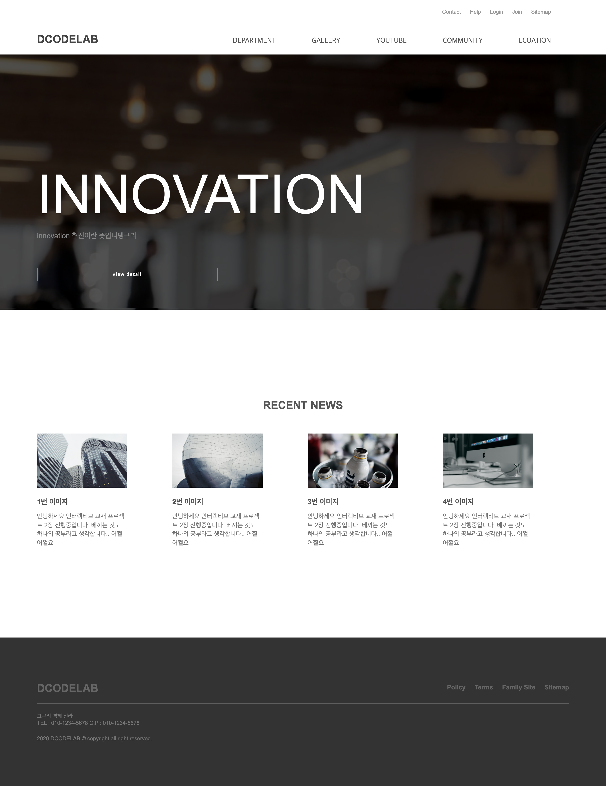

# 기업형 웹 페이지 제작하기

### 학습목표
---
- header, figure, section ,footer로 레이아웃을 배치할 수 있다.
- [css] wrap::after(가상선택자)를 사용하여 float을 해제할 수 있다.
  
- 부모 자식간 position의 역할을 알 수 있다.
- 선택한 부분만 돋보이게 하는 css 코드를 구현할 수 있다.

<br/>

### **html 코드**
---
```html
<header>
<div class="inner">
    <h1><a href="#">DCODELAB</a></h1>

    <ul id="gnb">     <!--실무엣 기업형 웹페이지를 제작할 때 주 메뉴의 아이디명을 'gnb'라 함-->
        <li><a href="#">DEPARTMENT</a></li>
        <li><a href="#">GALLERY</a></li>
        <li><a href="#">YOUTUBE</a></li>
        <li><a href="#">COMMUNITY</a></li>
        <li><a href="#">LCOATION</a></li>
    </ul>

    <ul class="util">
        <li><a href="#">Contact</a></li>
        <li><a href="#">Help</a></li>
        <li><a href="#">Login</a></li>
        <li><a href="#">Join</a></li>
        <li><a href="#">Sitemap</a></li>
    </ul>
</div>
</header>
```
```html
<figure>
    <video src="img/visual.mp4" autoplay muted loop></video>
    <div class="inner">
        <h1>INNOVATION</h1>
        <p>innovation 혁신이란 뜻입니뎅구리</p>
        <a href="#">view detail</a>
    </div>
</figure>
```
```html
<section>
    <div class="inner">
        <h1>RECENT NEWS</h1>
        <div class="wrap">
            <article>
                <div class="pic">
                    
                </div>
                <h2><a href="#">1번 이미지</a></h2>
                <p>안녕하세요 인터랙티브 교재 프로젝트 2장 진행중입니다. 베끼는 것도 하나의 공부라고 생각합니다.. 어쩔어쩔요</p>
            </article>
            
            <!--생략-->

            <article>
                <div class="pic">
                    
                </div>
                <h2><a href="#">4번 이미지</a></h2>
                <p>안녕하세요 인터랙티브 교재 프로젝트 2장 진행중입니다. 베끼는 것도 하나의 공부라고 생각합니다.. 어쩔어쩔요</p>
            </article>
        </div>
    </div>
</section>
```
```html
<footer>
        <div class="inner">
        <div class="upper">
            <h1>DCODELAB</h1>
            <ul>
                <li><a href="#">Policy</a></li>
                <li><a href="#">Terms</a></li>
                <li><a href="#">Family Site</a></li>
                <li><a href="#">Sitemap</a></li>
            </ul>
        </div>

        <div class="lower">
            <address>
                고구려 백제 신라 <br>
                TEL : 010-1234-5678 C.P : 010-1234-5678
            </address>
            <p>
                2020 DCODELAB &copy; copyright all right reserved.
            </p>
        </div>
        </div>
    </footer>
```

### **css 코드**
---
```css
/* header */

header .inner {
	width: 1180px;
	height: 120px;
	margin: 0px auto; /* 좌우여백 0, 중앙 배치 */
	position: relative; /* 자식 absolute 요소의 기준점 설정 */
}
header .inner h1 {
	position: absolute;
	left: 0px;
	bottom: 15px;   /* 왼쪽 하단에 위치 */
}
```
```css
/* figure */
figure .inner a:hover {   /* 마우스 올릴 때 배경 전환 */
	background: #fff;
	color: #555;
}
```
```Css
/* section */
section .inner .wrap::after {   /* article의 float 해제 */
	content: "";
	display: block;
	clear: both;
}
section .inner .wrap article {
	width: 200px;
	float: left;
	margin-right: 20px;
}
```
<br/>

### **결과**
---



<br/>

---
### **회고**
header, figure, section, footer의 특성을 이해하고 레이아웃을 배치할 수 있게 됐다. css 문법에서 position 설정과 가상선택자를 이용한 float 해제를 새로 공부하고 적용해볼 수 있었다.